# Book 1

Precise and unambiguous means are needed to describe this surface, inasmuch as the ship’s form must be configured to accommodate all internals, must meet  constraints of:
-  buoyancy,
-  stability,
-  speed and
-  power,
-  and seakeeping,
-  and must be “buildable.”

It is important that in all calculations and measurements relating to length, the method of determining the length used, and the location of its extremities be clearly defined.

## Developing a Set of lines. The development
of a set of lines presupposes a tentative (or final) selection of suitable hull dimensions, coefficients (section 3), LCB, sectional area curve (Fig.3) and design waterline.

This selection is based on considerations of displacement, capacity, trim, stability, resistance and propulsion,

 

# Section 2
## Displacement and Weight Relationships (page 37)

### Archimedes’ Principle

The fundamental physical law controlling the staticbehavior of a body wholly or partially immersed in a fluid is known as Archimedes’ Principle which, as normally expressed, states that  a body immersed in a fluid is buoyed up by a force that equals the weight of the displaced fluid.  
 Thus, the weight is considered to be a downward force that is proportional to the body’s mass; the equal buoyant force is proportional to the mass of the displaced fluid. 

Consider a body of fluid such as water, with a free surface, at rest. The fluid is of constant mass density, p (ie., mass per unit volume). At any pointP,a distance t below the free surface, the mass of fluid above the point is p At, where A is the cross sectional area parallel to the free surface of the column of fluid. In general, a fluid cannot support shear forces. Therefore, if the fluid be in a state of static equilibrium, it is necessary that equal forces be experienced in all directions at any such point. Since the gravitational force resulting from the mass of the fluid above is equal to its mass xg, the pressure force experienced by the fluid at that point is pg At-or the weight of the column of fluid above P.

The weight of a ship and its contents is equal to the weight of displaced water, or displacement. Likewise, the mass of a ship and its contents is equal to the mass of displaced water. Hence, displacement can be expressed in either weight or mass units.

It is evident that a fully immersed rigid body, such as a submarine, also experiences an upward buoyant force equal and opposite to the weight of the water it displaces. A totally submerged body may weigh either more or less than the displaced water. For the body to be in equilibrium in its submerged position, it would have to receive, in the first case, an additional upward force, and in the second case, an additional downward force. When submerged and not resting on the bottom, a body may remain stationary, without rising or falling, only in the unusual case when its mass exactly equals the mass of the water it displaces.

 

### Displacement and Center of Buoyancy

The volume of the underwater portion of a vessel may be calculated by methods outlined in Sections 4 and 5. The result is known as the volume of displacement, V (Gradient operator / nabla symbol), up to the waterline at which the vessel is floating. 
If we know the mass density of the water, p, in which a ship is floating, we can calculate the weight of the displaced fluid, or the displacement weight, W: W = pgV

By Archimedes’ principle this weight is equal to the weight of the ship and its contents.  In inch-pound (or “English”) units, W is in long tons if V is in ft’ and pg = 1135.9 long tonslft3(62.4 lblft’) in fresh water (FW) or pg = 1/35.0 long tons per ft3(64.0 lb/ft3) in salt water (SW); i.e., W = V/35.9 or V/35.0 long tons (2240 lb per ton) in FW or SW, respectively.

In SI (SystBme International), the above expression for displacement weight (Eq. 1)applies if units of force are newtons (with p in kg/m3) or kilonewtons (with p in t/m3). In FW the value of p g is approximately 9.81 kN/m3 ( p = 1.0 t/m3) and in SW p g is 10.06kN/m3( p = 1.026Urn3)). Such units are common in resistance and propulsion calculations (Chapter V).

However, adherance to the SI system obliges one to think of ship displacement, A, in mass units, rather than weight (force) units, with the unit of mass being a multiple of grams, such as a kilogram (1000 grams), or a metric ton (1000 kilograms) t, sometimes written as “tonne.”3 Hence, in the SI system, mass displacement, A = p V
where A is in metric tons, V is in m3, p = 1.00 t/m3 (equal to kg/L) in FW and p = 1.026 t/m3 in SW.

Since the mass density of fresh water is 1.0 kg/ L or 1.0t/m3, density is numerically the same in SI units as specific gravity, y (at standard temperature). Hence, it may be more convenient when using SI units to use, A = y V .

Sometimes naval architects prefer (as in Chapter 11) to make use of the reciprocal of density, or specific volume, 6 (volume per unit mass), in their calculations. For fresh water, of course, 6 = 1.00 m3/t; for salt water 6 = 111.026 = 0.975 m3/t.

The centroid is called the center of buoyancy. It represents a point through which the vertical buoyant vector is considered to pass, i.e., point B in Fig. 11

 

### Effect of Density of Medium:

A decrease in the density of the fluid in which a vessel floats requires an increase in the volume of displacement V in order to satisfy static equilibrium requirements. Therefore, a ship moving from salt water to fresh water, for example, experiences an increase in draft, ST.

This increase can be calculated by equating the increase in displacement volume to the volume of a layer of buoyancy of uniform thickness, ST,distributed original load waterplane.

|   |ship is “wall-sided”|hence|increase in draft is|
|---|---|---|---|
|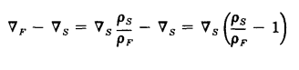|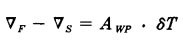|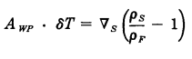|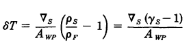|

The centroid of the underwater body may shift, both vertically and longitudinally, with such a change in medium.  
(In particular, an increase in draft as a result of a decrease in fluid density causes the vertical location of the center of buoyancy to rise with respect to the keel as a result of the increase in displacement volume, V .)

(When a ship becomes partially supported by mud of mass density put the volume of displacement must decrease to the point where the sum of products of volume of displacement in the medium multiplied by the density of the medium equals the weight of the vessel.)  
The center of buoyancy may be found, using methods in Sects. 4 and 5 by calculating the buoyant moment as the sum of products of buoyancy from each medium, multiplied by the distance to the centroid of each volume

It is important to use the correct density of the water in making displacement calculations. There is about a 2%percent difference between the density of fresh water, as in the Great Lakes, and the salt water of the oceans. 
In principle, since the density of water changes slightly with temperature, a correction should be made to account for any differences from an agreed upon temperature standard.

 

### Displacement vs. Weight Estimate:
When preparing the design for a proposed ship, a careful estimate of its total weight and position of its center of gravity should be made, as discussed in Chapter 11, Section 2. 
The total weight thus estimated may be compared later with the total displacement obtained from draft readings after the ship is afloat. 
If differences occur, as is usually the case, the error is assumed to be in the weight estimate.

 
 

# Section 4
## Integrating Rules and Methods:

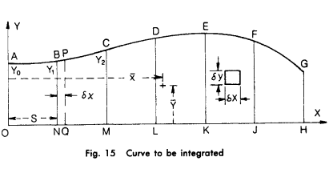

### General:

For a variety of reasons, it is necessary to be able to calculate areas, centroids, volumes-and other geometrical characteristics-of a ship’s form when floating at any prescribed waterline. 
Areas of the immersed cross sectional area at each body plan station and of each waterplane are of particular interest, not only for their own sake but because-as will be shown later-volumes can be calculated from areas. 
Because of the symmetry of the two sides of most vessels, most of these calculations need be performed for only one side of the ship and then multiplied by 2.

### Formulas For Area, Moment, Centroid, Moment of Intertia, and Gyradiur:

- Areas 
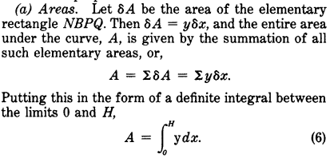

 

- Moments and Centroid 

|   |   |   |
|---|---|---|
|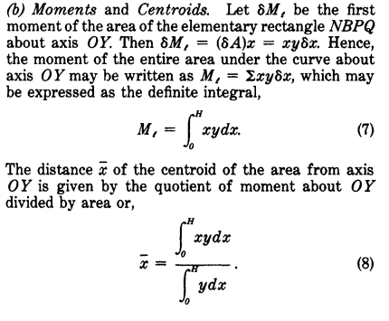|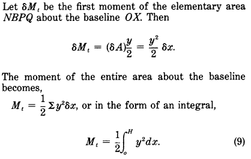|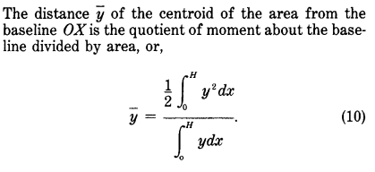|

 

- Moments of Inertia and Gyradii 

|   |   |   |
|---|---|---|
|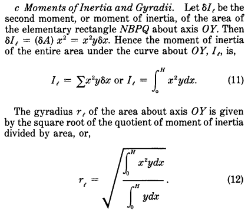|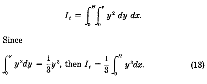|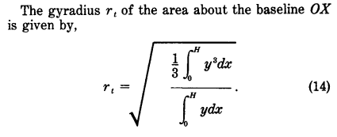|

 
 

# READ THIS PART (CONTINUE FROM HERE):

### Trapezoidal Rule

In Fig. 15 each portion of the curve AB-G between pairs of ordinates as AB, BC, etc. is considered to be approximated by a straight line through each pair of points.

 

### Simpson’s First Rule

This rule, and that to follow in 4.5, are part of a group of rules known as Newton-Cotes Rules. Simpson 's First Rule rigorously integrates the area under a curve of the type y = a + bx + cx2,which is a second order parabola, or polynomial of degree 2, by applying multipliers to groups of three equally spaced ordinates. That is, if the portion of the curve in Fig. 15 extending from A to C is parabolic, and the ordinates y,,,yl,and y, are equally spaced, then the area found by Simpson's First Rule is precisely correct. Inasmuch as many ship curves are not dissimilar to the parabola, the area so found is a close approximation to that of the ship, and the rule is widely used in naval architecture.

 

### Simpson’s Second Rule

This rule correctly integrates the area under a third order parabolic curve, or polynomial of degree 3, when four equally spaced ordinates are provided. The derivation of appropriate Simpson’s multipliers is achieved using similar steps to those outlined in Sect. 4.4.

 

### Single Interval Rules

 

 
 

 
 
 
 
 

# Extras:

##  Coefficients of Form (Section 3)
### General
In comparing ships’ hull forms, displacements and dimensions, a number of coefficients are used in naval architecture. These coefficients are useful in power estimates and in expressing the fullness of a ship’s overall form and those of the body plan sections and waterlines.

### Definitions and Uses of Coefficients
- Block Coeficient, CB. This is defined as the ratio of the volume of displacement V of the molded form up to any waterline to the volume of a rectangular prism with length, breadth and depth equal to the length, breadth and mean draft of the ship, at that waterline. 
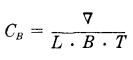 
Values of C, at design displacement may vary from about 0.36 for a fine high-speed vessel to about 0.92 for a slow and full Great Lakes bulk carrier. 
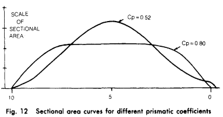

 

- Midship Coeficient, C,. The midship section coefficient, C,, sometimes called simply midship coefficient, at any draft is the ratio of the immersed area of the midship station to that of a rectangle of breadth equal to molded breadth and depth equal to the molded draft amidships. 
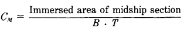 

 

- Prismatic Coeflcient, C,. The prismatic coefficient, sometimes called longitudinal prismatic coefficient, or simply longitudinal coefficient,gives the ratio between the volume of displacement V and a prism whose length equals the length of the ship and whose cross section equals the midship section area. 
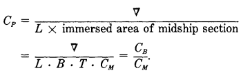 
This coefficient is a measure of the longitudinal distribution of a ship’s buoyancy. 
If two ships with equal length and displacement have different prismatic coefficients, the one with the smaller value of C, will have the larger midship sectional area ( B . T . C,) and hence a larger concentration of the volume of displacement amidships. (See Fig. 12.) 
Prismatic coefficient is a frequently used parameter in studies of speed and power (Chapter V). Usual range of values is from about 0.50 to about 0.90. A vessel with a low value of C, (or C,) is said to have a fine hull form, while one with a high value of C, has a full hull form.

 

- Waterplane Coeflcient, C,. The waterplane coefficient is defined as the ratio between the area of the waterplane A , and the area of a circumscribing rectangle. 
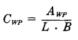 

 

- Vertical Prismatic Coeflcient, Cvp. This coefficient is the ratio of the volume of a vessel’s displacement to the volume of a cylindrical solid with a depth equal to the vessel’s molded mean draft and with a uniform horizontal cross section equal to the area of the vessel’s waterplane at that draft. 
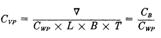 

 

- Volumetric Coeflcient, C,. This coefficient (or fatness ratio) is defined as the volume of displacement divided by the cube of one tenth of the vessel’s length  
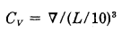 
These coefficients express the displacement of a vessel in terms of its length. Ships with low volumetric coefficients might be said to be “thin”, while those with a high coefficient are “fat.” Values of the volumetric coefficient range from about 1.0 for light, long ships like destroyers, to 15 for short heavy ships like trawlers.

 

- Ratios of Dimensions. The three principal dimensions of the underwater body are sometimes referred to in ratio form. 
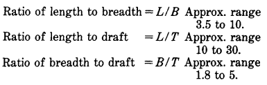 

 

### Geometrical Modification to Lines

It frequently happens during the design of a ship that unexpected requirements which were not foreseen necessitate a change in dimensions without changing the coefficients of form. Examples are an increase in breadth to provide greater stability, a decrease in d e sign draft to allow entering a port with restricted water depth, or an increase in length to reduce wavemaking resistance. 
 If this should happen after preliminary lines are faired, it seemingly requires that a completely new set of lines be drawn and faired. However, by making systematic changes in the offsets, it may be possible to accomplish the desired transformation without disturbing the fairness of the lines, and without necessitating complete recalculation of the curves of form. 
For example, a simple respacing of body plan stations leads to an elongation or shortening of the lines at constant breadth and draft, with displacement changing in direct proportion to the station spacing; the form coefficients C,,C,, C,, Cwpand C, will not change, and the fairness of lines will be preserved. 
The combined effect of two or more of such changes is multiplicative. For example, if the length of the vessel were to increase 10 percent by an increase in station spacing, the breadth were to increase 5 percent by an increase in halfbreadths, and the draft were to decrease 8percent by a reduction in waterline spacing, the resulting volume of displacement V, would be obtained from V,, the initial volume of displacement, by  
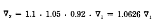 
A new body plan, waterlines plan and profile could be drawn directly, in which new longitudinal distances x, are obtained from old longitudinal distances x, by z2= 1.1x,;new halfbreadths y, are obtained from old halfbreadths y, by yz = 1.05 y,; etc
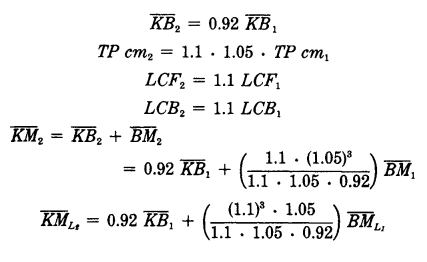 
Methods have been developed (Rawson & Tupper, 1983) to estimate modifications to the geometrical quantities on the basis of partial derivatives. 
A traditional and practical way of shifting the LCBof a new design without changing displacement isknown as the method of swinging stations. (Fig. 13) 
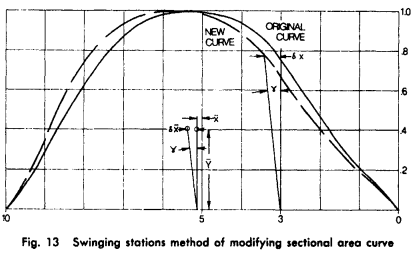

 

 
 

# TODO:
- [ ] Write a "Basics" chapter and start with this:
  - buoyancy,
  - stability,
  - speed and
  - power,
  - and seakeeping,
  - and must be “buildable.”
  - (bathymetry)

- [ ] Subchapter under "Basics":
  - [ ] [Archimedes’ Principle](#archimedes-principle)
  - [ ] [Displacement and Center of Buoyancy](#displacement-and-center-of-buoyancy)
  - [ ] [Effect of Density of Medium](#effect-of-density-of-medium)
  - [ ] Mention [Displacement vs. Weight Estimate](#displacement-vs-weight-estimate)

- [ ] Ask and write about this:
  - [ ] [Formulas For Area, Moment, Centroid, Moment of Intertia, and Gyradiu](#formulas-for-area-moment-centroid-moment-of-intertia-and-gyradiur))
    - Formulas, what are they for?
    - What is the difference between them?
    - Why is it important to know them?
    - ...
- [ ] If the [Coefficients of Forms](#extra_1) is usable in this case:
  - [ ] Write about [Definitions and Uses of Coefficients](#definitions-and-uses-of-coefficients)
  - [ ] Half a page about it and not deeply detailed (just the basics)

- [ ] Quick read about (calculating of curves and areas based on them):
  - [ ] Trapezoidal Rule
  - [ ] Simpson's First Rule
  - [ ] Simpson’s Second Rule
  - [ ] Single Interval Rules
  - [ ] Higher Order Curves
  - [ ] Half-Spaced Ordinates
  - [ ] Tchebycheff'r Rules
  - [ ] Integration For Arbitrarily Spaced Ordinates
  - [ ] Combining Rules for Any Number of Ordinates
  - [ ] Polar Integration

 
 
 

Centroid calculation:
The centroid of the underwater portion of a vessel may be calculated by the principle of moments, using methods also outlined in Sections 4 and 5

Concepts:
- centroid:
  - the center of buoyancy. It represents a point through which the vertical buoyant vector is considered to pass (fig 11)
  - The center of buoyancy may be found, using methods in Sects. 4 and 5
