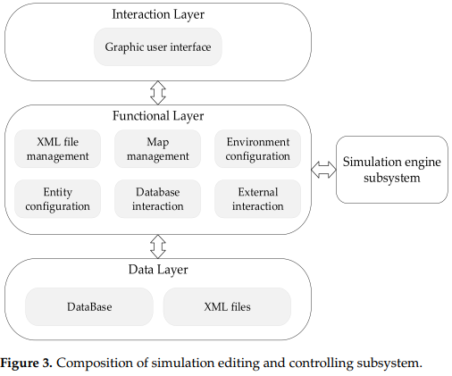
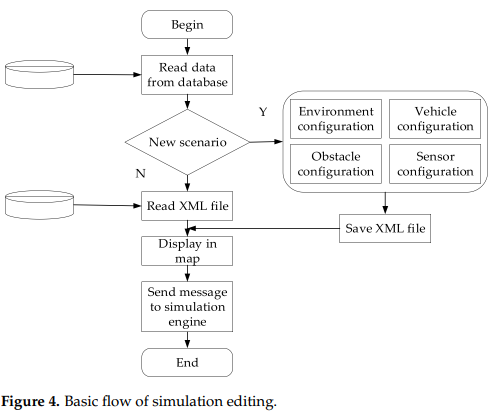
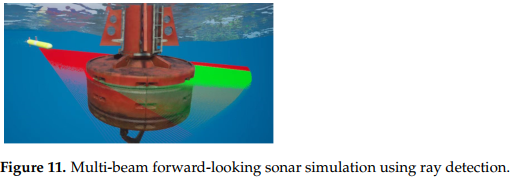
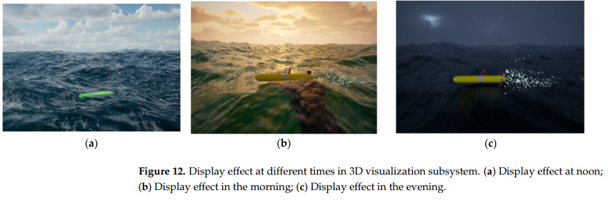
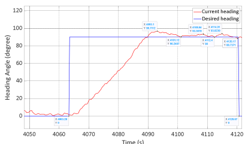

# Design and Implementation of Autonomous Underwater Vehicle Simulation System Based on MOOS and Unreal Engine

## Abstract
An effective autonomous underwater vehicle (AUV) simulation system can greatly improve
development efficiency and reduce the cost and risk of actual equipment operation.

A comprehensive simulation system is developed using Mission Oriented Operating Suite ([MOOS](https://www.semanticscholar.org/paper/MOOS-Mission-Orientated-Operating-Suite-Newman/5abb6be8b008d898f6aec4d76f3eefb26a905c7b)) and Unreal Engine 4 (UE4)

The developed system consists of four subsystems, including the simulation editing and controlling subsystem, shore-based operation 
subsystem, simulation engine subsystem, and three-dimensional (3D) visualization subsystem.
These subsystems have modular characteristics and independent functions and communicate with each other through network sockets.

## Introduction
AUV has a wide range of applications in the ocean exploration field, such as seabed mapping, mineral investigation,
pipeline monitoring, hydrological survey, and military reconnaissance.

AUV faces many challenges when working in an underwater environment, including
- acoustic communication with a small bandwidth and large delay
- rapidly increasing water pressure with increasing depth
- ocean current that significantly affects vehicle motion
- no signal from the global positioning system (GPS) due to severe attenuation of the radio

 

So the development of AUV requires particular technologies of:
- navigation [4]
- localization [5]
- communication [6]
- trajectory tracking [7]
- path planning [8]
- mechanical structure

 
The cost of developing an AUV is relatively high and accidental damage or sinking of AUV during experiments or sea trials can cause huge losses.  

**Therefore, it is very necessary to have an effective and friendly simulation system used to verify the algorithms and functions before experiments or sea trials [10,11].**

The simulation of AUV mainly involves hydrodynamics and acoustic sensor modeling.
There are already some relatively mature simulation systems available, such as UWSim, UUVSimulator, Aqua Underwater Simulator [15],
Stonefish [16] and HoloOcean.

Aqua:
And all sensors and dynamic models are integrated into UE4, which is not applicable in console mode.

HoloOcean [17]:
Open source underwater robotics simulator built on UE4.
All the models of vehicles and sensors are integrated into UE4, which is not applicable in console mode.
In addition to that, not all resources in HoloOcean are open access

Through the investigation of existing simulation systems, it can be seen that most of them depend on ROS or provide ROS interactive interfaces. And there are few simulation systems developed based on MOOS. However, MOOS is a popular and universal system framework,
specially for underwater vehicles [18–21].
And there has been a simulation system developed for the simulation of underwater vehicles in MOOS.

Key features:
- combination of MOOS and UE4 is researched and developed
- system provides user-friendly operation, especially for the training of AUVs
- system is designed with a highly modular architecture

### 2.1.1. Simulation Editing and Controlling Subsystem

One function is to edit the simulation scenario, such as simulation time, obstacle information, sensor parameters, and AUV information.
The simulation scenario can be saved as XML file to facilitate retention and reuse.

Another function is to control the simulation process, such as starting, ending, and pausing simulation. These two functions are operated
through graphic user interface, which is developed using QT.
The simulation scenario and control commands are eventually sent to the simulation engine subsystem.

#### 4. Vehicle dynamic simulation module

- GPS:
Due to the severe attenuation of GPS signal underwater, GPS is only available after AUV floats to the surface. It is used for navigation
and calibration when AUV is at the surface.

- Camera:
Underwater photography is one of important environmental perception tools which can be used in object detection [36],
image processing [37], visual navigation [38], and so on.
With realistic 3D display and support for multi-view cameras in UE4, underwater camera simulation is feasible
and has high-fidelity imagery [15].

- Forward-looking sonar:
Forward-looking sonar is mainly used to detect obstacles and targets. In the simulation, a multi-beam forward-looking sonar
is simulated based on its working principle. The sonar emits ultrasound beams in the forward direction
and detects those reflected from object surfaces. And the ultrasound beams can be modeled as a set of rays [39,40].
Here, the ultrasound beams of sonar are described using rays in UE4, as shown in Figure 11.
Ray detection is one of very useful features in UE. It can return the distance between AUV and obstacle automatically,
which can be used to model the sonar.

### 2.1.4. Three-Dimensional Visualization Subsystem
In order to improve the display effect, a number of plug-ins are used in the subsystem, such as plug-ins named Oceanology
and Ultra Dynamic Sky. The plug-in named Oceanology is used to render the marine environment, and Ultra Dynamic Sky
is used to render the sky at different times and display the effect of different weather.

#### Results

A set of heading control data in an experiment of physical AUV is shown in Figure 17 for comparison. In the experiment, the speed is 1 m/s,
and the desired heading angle is from 0 to 90 degrees. It can be seen that the heading angle of AUV is more unstable
due to complex environmental impacts such as ocean currents, but the trend is toward 90 degrees. In addition to that,
there are some other differences between real experiments and simulations, such as greater steady-state error, higher overshoot,
and longer transition time from 0 to 90 degrees.

