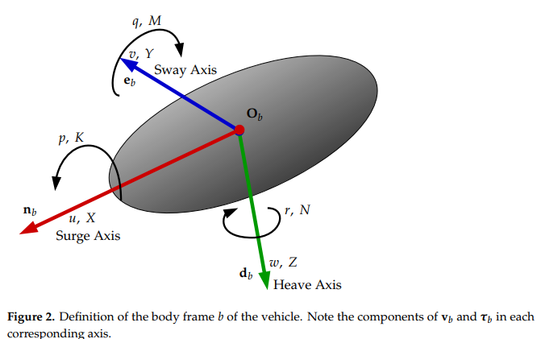

# Simu2VITA: A General Purpose Underwater Vehicle Simulator

## Abstract

Unmanned Underwater Vehicle simulator named Simu2VITA, which was designed to be rapid to set up, easy to use, and simple to modify the vehicle’s parameters.
Simulation of the vehicle dynamics is divided into three main Modules: the Actuator Module, the Allocation Module and the Dynamics Model.

- The Actuator Module is responsible for the simulation of actuators such as propellers and fins
- The Allocation Module translates the action of the actuators into forces and torques acting on the vehicle
- The Dynamics Module implements the dynamics equations of the vehicle.

Simu2VITA implements the dynamics of the actuators and of the rigid body of the vehicle using the MATLAB/Simulink® framework.

Simulation results are presented for an unmanned underwater vehicle navigating inside a fully flooded tunnel and then compared with sensor data collected when the real vehicle performed the same mission using the controllers designed employing the simulator.

Working with mobile vehicles often proves to be time consuming and, adding to the
natural complexity of the matter, typically, there is also the additional burden of using
complicated simulators. Simulators are a necessity when dealing with mobile vehicles
since they allow the design team to increase its knowledge about the vehicle’s behavior
and to test different scenarios. Quality of simulation is a requisite that rapidly grows
in importance as the cost of equipment increases and the environment becomes more
hazardous to operate.

Our research project aims to design an UUV to be used for the inspection of adduction tunnels in hydroelectric power plants.
Requirements:
- Overall design simple and easy to understand, implicitly implying low structure complexity to configure an experiment
- Easy description and modification of the vehicle physical parameters, its actuators and its sensors
- Rapid testing of the different types of speed and position controllers
- Simple to add features on top of it such as vehicle autonomous behaviors
- Dynamic model completeness

Popular simulators:
- Gazebo:
  - great physics accuracy in simulation and in customization
  - learning curve is steep
- Webots:
  - rich-feature simulator
  - learning curve is steep
they require complex file-based descriptions of the vehicle

Chosen MATLAB/Simulink® due to its popularity among engineers and for being the academic and industry standard for the simulation of mechanical and electrical systems

UAVs and UGVs travel through air, which is a very low-density fluid.
Differently, USVs (Unmaned Surface Vehicles) and UUVs are partially or fully submersed in water, which is a much denser and (for our purposes) incompressible fluid. Consequently, for the simulation of these vehicles, one has to consider hydrodynamics forces (namely buoyancy, drag and lift) and fluid inertia.
Fluid inertia is modeled using the concept of Added Mass [4], which can be defined as the fluid mass deflected by the movement of the vehicle.

Designers of UUV simulators have basically two options:
- add a fluid simulation extension to an existing UAV/UGV simulator (such as Gazebo or CoppeliaSim)
- or design the simulator from the ground up.

### Simulator options

Gazebo from Open Source Robotics Foundation is a free open-source general-purpose
3D simulator that can handle multiple robots and has an extensive library of ready-to-use
vehicle models. It was originally built to satisfy the need for a high-fidelity vehicle simulator
in outdoor environments. Being in development since the early 2000s, the simulator now
includes many sophisticated features such as over-the-network and cloud simulation. A
simulated scenario configuration in Gazebo is done using SDF (Simulation Description
Format) files [5] to describe the vehicle (in terms of its joints) and its environment. SDF is a
XML-based format that was derived from URDF (Unified Robotic Description Format) [6].
However, Gazebo was not originally designed to simulate rigid bodies moving through
a dense fluid such as water. Taking advantage of the Gazebo plugin architecture, an
extension to add fluid simulation named Fluids [7] was created. However, its web page
states that this plugin is experimental and outdated by now. There are also the Buoyancy [8]
and Lift-Drag plugins [9], which allow simplified underwater vehicle simulations but
have complicated parameter configurations such as the slope of the lift curve. The Orca3
software package [10] offers a set of four Gazebo plugins (Thruster, Barometer, BuoyancySensors 2022, 22, 3255 3 of 27
and Drag) but is specific for the BlueRobotics BlueROV2 UUV. The added mass effect on
the dynamics of the UUV rigid body is not addressed by Gazebo on its own nor by any of
its above-mentioned plugins.
A low-complexity alternative that also extends Gazebo is to use the free open-source
UUV Simulator package [11]. It defines several plugins to implement hydrostatic and
hydrodynamic effects, thrusters and sensors. This simulator allows the addition of the
added mass information, which enhances the simulation accuracy. It also uses the modular
design of Gazebo to enable the simulation of multiple underwater vehicles.

CoppeliaSim (formerly known as V-REP) from Coppelia Robotics is an open-source
commercial (but free if used for educational purposes) simulator that competes directly with
Gazebo. Both are stand-alone ground and aerial robot simulators with similar features such
as over-the-network simulation (i.e., the robot and its controllers can be implemented in
different computers) and capability extension using plugins. Both simulators also offer a few
options for selection of the physics engine (https://gazebosim.org/blog/four_physics, https:
//www.coppeliarobotics.com/helpFiles/en/dynamicsModule.htm)
One alternative for CoppeliaSim to simulate UUVs is to select the Vortex Studio
physics engine [12] (p. 56), which is a closed source and commercial engine but free for
registered academic users. This engine implements the buoyancy, lift and drag forces and
the added mass effect. A second alternative is to directly modify the selected CoppeliaSim
physics engine to include fluid simulation and the added mass effect. Lu and Liu [13] have
claimed they did that, but no further details were given.

The Webots Robot Simulator [2] from Cyberbotics Ltd. is also free open-source standalone simulator. It also shares many similarities with Gazebo and CoppeliaSim such as
multiple robot simulation, collision detection between bodies, headless simulation over
network (when the visualization is not required or is shown in a different machine and
only the background computation of the simulation is performed in the simulator host
machine), and ready-to-use models of sensors and robots. Webots also allows the addition
of external forces to be added to the physics engine to create, for instance, a constant wind
force affecting the vehicle. External communication with the simulator is possible using
different approaches such as through a generic TCP/IP socket or using an API (Application
Programming Interface) to an external application such as a program written in C/C++,
Java, Python or MATLAB®. Webots is in many ways more suited for underwater simulation
than Gazebo without plugins, since it includes fluid simulation (https://cyberbotics.com/
doc/reference/fluid (accessed on 12 April 2022)) by design. However, apparently Webots
does not consider the added mass effect since its documentation does not mention it.

- The Actuator Module implements the dynamic model of the actuators using for each
of them an input signal saturation followed by a simple first-order system. Actuator
inputs are handled by this module.
- The Allocation Module describes how the forces generated by the vehicle actuators
are mapped into forces and torques acting on the body of the vehicle.
- The Dynamics Module has two main software components: the kinematics component that treats only geometrical aspects of the vehicle motion, and the kinetics
component, which deals with the effect of forces and torques applied to the body of
the vehicle.

## IMPORTANT
Each axis of the body frame fbg is named according to the nomenclature defined
by the Society of Naval Architects and Marine Engineers (SNAME) [15]
The vector n is named the Surge Axis, e is the Sway Axis and d is the Heave Axis.

