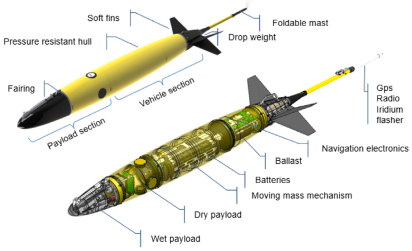
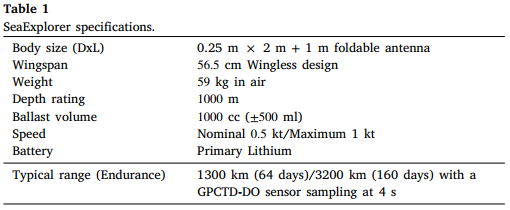
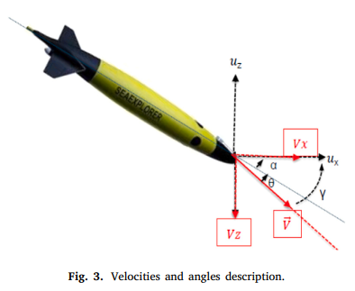
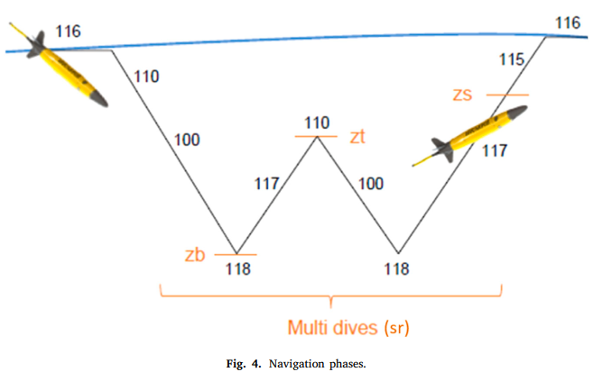
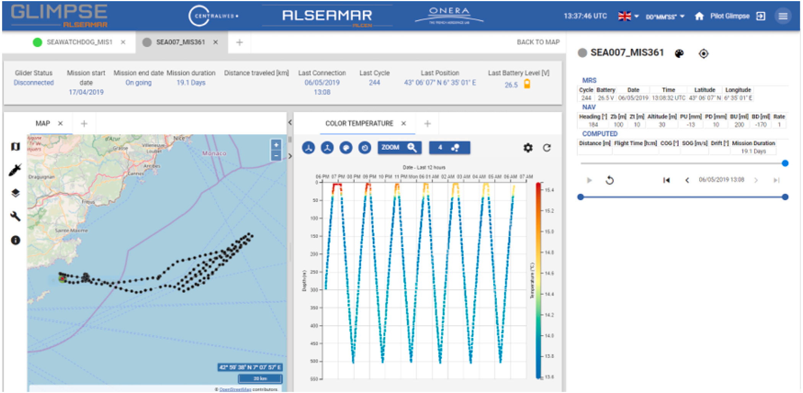
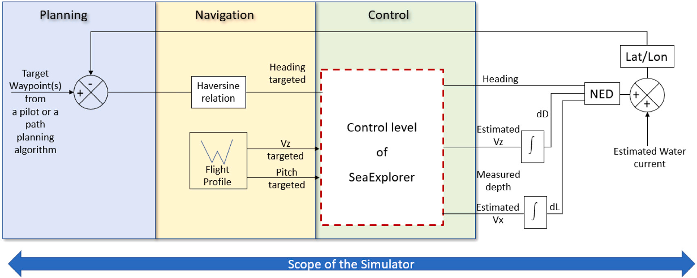
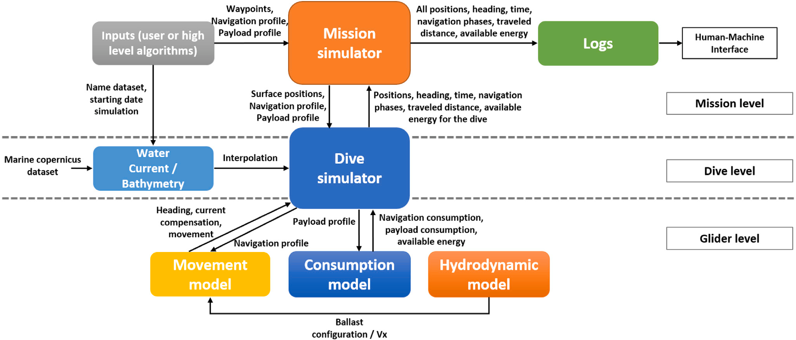

# A simulator of underwater glider missions for path planning

## Abstract

In this article, we present a mission simulator developed for the Alseamar SeaExplorer underwater gliders.
By taking into consideration a 4D time-varying environment, it provides an estimation of the most important
metrics: the battery level, the mission duration and the distance traveled by the glider.
The main strengths of this simulator are first its use upstream as a tool to aid the glider pilots to define
a feasible mission plan.
This simulator is compared to a real experimental mission in order to confirm its accuracy and efficiency.

## Introduction

Autonomous Underwater Gliders (AUGs) were invented in order
to address the growing need for measures performed in marine environments on large spatial and temporal scales. They were designed
to be easy to use, scalable and relatively ‘‘cheap’’ compared to other underwater vehicles.
Their original goal was to collect water column data profiles with wide spatio-temporal coverage
(thousands of kilometers and weeks to months of endurance).
A glider is profiled for hydrodynamics in order to perform long endurance missions.
In our case, the longer-term objective is to make the operating system of the gliders more autonomous.

The existing state-of-the-art simulators dedicated to robotics can
be classified into three main categories, depending on the type of
environment that is considered: mobile ground, aerial and marine. Most
of them address both mono and multi-vehicle problems. They also
emulate different types of data acquisition from many sensors and can
be coded in different languages (the most popular ones being C++,
Python and Java).

- First, in mobile ground robotics, the environment is largely known and can be imported from
digital elevation models, SDF meshes, OpenStreetMap. The most famous simulators are Gazebo, CoppeliaSim (Rath et al., 2018; Tai et al., 2017; Chen et al., 2017), Webots and CARLA (Codevilla et al., 2017; Zhang et al., 2018; Dosovitskiy et al., 2017). Notice that Webots and Gazebo are used both for ground (Winkler et al., 2018; Bellicoso et al., 2018-07; Takaya et al., 2016; Zhao et al., 2015; Juang and Yeh, 2018) and aerial robotics (Koenig and Howard, 2004; Schmittle et al., 2018; Imanberdiyev et al., 2016; Mahdoui et al., 2019; Michel, 2004).

- Two other simulators are specifically dedicated to aerial robotics: AirSim (Shah et al., 2017) and Flightmare (Song et al., 2020). They
allow to run the simulation of high-fidelity environments (warehouses, forests, etc.).

- Finally, concerning the marine environment, it remains the most complex one because it focuses on a relatively unknown and
highly fluctuating environment. Three simulators can be mentioned: UUV Simulator (Manhães et al., 2016), UWSim (Prats et al., 2012),
StoneFish (Cieślak, 2019). These simulators compute the full dynamics and hydrodynamics coefficients of autonomous underwater vehicles.

- The SeaExplorer model has not been implemented in these simulators so far. Thrusters, sensors (such as DVL, pressure sensors, USBL, sonars,
acoustic communication device, cameras and so on) and robot arm can be simulated. They also simulate complex and realistic underwater
environments such as:
  - currents,
  - waves,
  - seabed,
  - lakes, etc.  

Until now, they are not dedicated to path planning and vehicle routing and do
not provide the important metrics to be considered in such problems (mission duration, remaining energy and travel distance).

The main objective of this article is to introduce a new full mission simulator for SeaExplorers gliders in a time-varying large scale
environment. This is an ongoing problem as highlighted by recent publications such as Phoemsapthawee et al. (2013) and Grande et al.
(2021). There is also a real need for this kind of simulator in order to help the SeaExplorer’s pilots to prepare the mission (offline mode)
but also during the execution of the mission (online mode).

The simulator that we developed takes into account:
- Environmental data from the Marine Copernicus database (Marine Copernicus database, 2015),
- The flight profiles of the SeaExplorer gliders,
- A mono and multi-vehicles configuration depending on the kind of undertaken mission,
- The output of high level path planning algorithms (i.e. Hamiltonian path Rahman and Kaykobad, 2005 for example, etc.)

and provides:

- Information and forecast on consumption using models,
- The interoperability with the Alseamar mission management system GLIMPSE (GLIder Mission Piloting SystEm Besson et al., 2019). This means a precious decision aid for the end-users i.e. the SeaExplorer’s pilots during both the mission preparation(path planning and choice of a feasible mission plan) and the progress of the mission (internal model and replanning),
- A metrics report through a human–machine interface,
- When weighted graph (Bondy and Murty, 1976) based path planning algorithms are considered, it is possible to use the simulator to build the adjacency matrix (measure of the cost between any points and their neighbors taking into account either the
distance or the travel time or the energy consumption),
- A comparison between the different mission plans provided by high level path planning algorithms but also between the different scenarios depending on the navigation profiles and the embedded sensors.

It is very interesting to have such a tool to reduce the cost and the time dedicated to the mission preparation phase. The simulator also needs to be scalable in order to easily integrate simulated data acquisition for real time adaptive behavior.

## SeaExplorer: principle and current operating process

### 2.1. The vehicle model

For the sake of battery saving and thus for the autonomy, the SeaExplorer does not rely on an energy consuming means of propulsion. The embedded AHRS (Attitude Heading Roll Sensor) provides measures of the roll angle, the pitch angle and the heading whereas the depth is separately measured by a depth sensor. So Fig. 2 gives a glimpse of the way the glider works with regards to its control level.

Underwater displacement is done by ‘‘hovering’’ between the surface and the desired depth, using gravity to descend along the water
column and Archimede’s force to rise.

For the ascending phase, the bladder is inflated thanks to a motorpump which is controlled to generate a constant flow value independently of the surrounding pressure due to the depth of the vehicle (nevertheless the energy consumption of this actuator varies with this pressure thus the depth). The duration of inflation is modulated to reach the desired value of buoyancy.

A summary of the main specifications of the SeaExplorer glider can be found in the Table 1.

Over one ‘‘yo’’, the glider follows different navigation sequences, and thus different phases numbered from 100 to 118:

- State 115 (‘‘Surfacing’’): the moving mass and the ballast are set to deploy the antenna out of the water for communicating. The vehicle inflates the bladder (+400 ml position – up to 500 ml) and the moving mass moves forward to pitch down.
- State 116 (‘‘Transmitting’’): the glider is communicating at the surface. The GPS position is computed and the exact location is transmitted by radio frequency or Iridium. Navigation orders and data can be received and transmitted.
- State 110 (‘‘Inflecting down’’): the glider starts inflecting down. The ballast is adjusted (oil bladder deflated) to make the glider heavy and the moving mass moves forward to make it pitch down.
- State 100 (‘‘Going down’’): the ballast is in its diving position. Depending on the configuration, it adjusts the pitch angle and the heading.
- State 118 (‘‘Inflecting up’’): once depth or altitude reached, the glider starts inflecting up. The ballast is adjusted (oil bladder inflated) to make the glider buoyant and the moving mass moves backward to make it pitch up.
- State 117 (‘‘Going up’’): the ballast is kept in the same position while returning to the surface. The glider controls the pitch angle and the heading.

#### 2.1.3. Hydrodynamic and energy consumption

The role of the hydrodynamic model is to compute the **angle of attack (𝜃)** which **varies with the pitch (𝛼)**.
Such a model depends on the characteristics of the vehicle:
- dimensions,
- weight,
- positions of the centers of buoyancy
- mass,
- 3D drag coefficient
- ...

By considering the drag forces 𝐷𝑥, 𝐷𝑦, the weight 𝑃 , the buoyancy 𝐵 and the fins lift 𝐿, the model gives the pitch, the glide speed and the glide angle
(Fig. 5).

Because of the non-linearity of the drag forces and the speeds, the hydrodynamic model of the SeaExplorer relies on specific tables to evaluate all its current characteristics. This accurate model provides the vertical and horizontal speeds (respectively 𝑉𝑧, 𝑉𝑥) used to estimate the underwater position of the glider during a dive.

The intrinsic mechanical parameters of the vehicle are included in the hydrodynamic model. The outputs of this block are related to the glider displacement either estimated or measured. During the going up and down phases, the energy consumption is essentially due to the payload. The rejection of potential disturbances ensured by the heading and the pitch controllers is negligible.

The actuators, moving masses and ballast, are the main reasons of the energy consumption.
It does not depend on the depth contrarily to the ballast actuation whose energy consumption straightly varies linearly with the water pressure, thus the depth. The power considered is related to the depth then the energy is the product of the power and the time of actuation

To introduce the simulator, the whole glider SeaExplorer is represented by a physical model (hydrodynamics) and experimental behavioral model and control model (for each control variable namely the buoyancy, the roll and the pitch).

Such a modeling is relevant for the simulator we aim at designing because its goals focus on the mission preparation, the path planning and navigation rather than on how to improve the hydrodynamics model or the accuracy of the control of the actuators.

 

### 2.2. Control-command current process

Before starting a glider mission, a vehicle configuration has to be defined.
Presently, the planning and navigation tasks are done by a pilot all along the mission to define the steering of the gliders through the mission management system named GLIMPSE.

#### MAP PART

**Either for the mission preparation phase or during the supervision of the missions, the Alseamar’s pilots have access to a variety of maps such as water current maps, bathymetric maps, temperature maps. These maps are available from the Marine Copernicus database and help the pilots to define an achievable mission plan for the gliders. They also respond to a real operational need. These products can be obtained through experimental measurements led on an area or thanks to a numerical model (e.g. water current model). The latter gives a larger temporal coverage than the products resulting from observations. It is also possible to retrieve the forecasts for the next few days and to have the measurements available in depth on a certain part of the water column. Thus, the current models remain the most used
products by Alseamar’s pilots**

Defined in 4D (3D + time), they play a key role in the mission preparation and supervision phase. However, it is important to notice that the spatial and temporal sampling of these data are different from the effective sampling time of the glider.

Finally, before starting a mission, a consumption model of the SeaExplorer glider is used in order to compute the total number of segments achievable. A Battery Management System (BMS) is also embedded on the battery pack of the glider. It allows pilots to retrieve information about the battery level during the mission through the mission management system. The mission plan can be adapted according to the remaining energy.

Fig. 7 depicts the three functional levels of behavior of the glider relative to its current mission (planning), relative to its environment (navigation) and relative to its own internal states and its actuators to make them change (control).

## 3. Simulator specifications

It also means that the important features of GLIMPSE are an integral part of the simulator:
- calculation of the heading of the glider for the target waypoint (Section 2.2),
- possible modification of the navigation profile (Section 2.1.1),
- activation/deactivation of sensors (payload profile) (Section 2.2),
- activation/deactivation of the water current compensation (Section 2.1.4).

It is the reason why the development of the simulator is based on the GLIMPSE ‘‘mission plan’’ mode. This mode is crucial for the glider mission simulation in both single and multi-vehicles configurations.

importance for the running of a full mission:
- hydrodynamic (Section 2.1.3)
- consumption models (Section 2.2) of the glider,
- environmental modeling (4D water current and 3D bathymetry levels),
- near ‘‘real-time’’ management of fleets.

Tt is important that the simulator allows generating the trajectories on the geographical plane and not only on the Cartesian plane.
The shape of the Earth and the geographical position of the simulated drone may affect the accuracy of the trajectory.

An adaptive sampling time is calculated in the simulator to reduce the computational cost.

It consists of computing the time step size required for the simulated glider to reach the immersions available in the used water current dataset. The simulator also provides a Human–Machine Interface (HMI). It allows an easy access to the various graphs displayed from the GLIMPSE mission management system:
- The trajectory of the vehicle in the Cartesian and geographical coordinate system,
- The battery level which decreases as a function of time,
- The consumption of the navigation and payload parts which vary as a function of time,
- The targeted and the followed heading,
- The navigation phases,
- A display of different metrics such as the total time of the simulated mission, the distance traveled by the simulated vehicle, the energy still available at the end of the mission.

In addition to meeting these requirements, the simulator has to include the three functions described below:

1. For a given path to follow and payload configuration, the simulator estimates the time to travel, the continuous autonomy and the accuracy to stick on the desired path. So for the preparation phase, the simulator is used in direct mode to aid the pilot to make a decision relative to the best route to follow and to the
best payload configuration (planning phase).

2. During the mission, the simulator assists the pilots in their navigation tasks for the definition of the best flight profile and path to adopt by integrating the surrounding bathymetry and water currents given by the dedicated maps.

3. Regarding the path planning, the simulator can integrate the bathymetry and the behavior of the controlled glider by taking into account the surrounding environment (water current given by satellite maps) to accurately assess the cost to travel from a point A to a point B. The simulator is a powerful tool to fill adjacency matrices due to its calculations of the duration, the travel distance and the energy consumption. It enables to measure the cost between any points and their neighbors and thus the edges connecting the vertices of a weighted graph (Bondy and Murty, 1976). These graphs are used to model the tackled problem and the adjacency matrices are the representation used to minimize the cost function in high level path planning algorithms. Moreover the simulator can evaluate the efficiency of these algorithms. It means that in one hand it provides high level algorithms with important data relative to the travel cost but also it helps to compare the different strategies (paths) to meet the requirements of a mission. It is a substitute for the pilot in the planning phase but also in the navigation phase. The aim is to tend to a full automatic mission controller for one glider as well as a fleet.

### 4. Simulator framework

This simulator is coded in Python Object and encompasses several files corresponding to the different classes that were developed.

The global architecture is structured in three levels called:
- ‘‘Mission level’’:
    - It is centered around a ‘‘Mission simulator’’ which is supplied by inputs from the users or high level algorithms. Most parameters of interest are stored in the ‘‘Logs’’ class, which possibly interacts with the HMI in order to provide a visualization of the important metrics and graphs (as detailed in Section 3) to help the end-users in their choice and validation of a given mission plan.
    - This ‘‘Mission simulator’’ main function manages the chaining and validation of a sequence of waypoints. The latter are considered as hit when the distance between the geographical position (latitude, longitude) of the glider and the target waypoint is shorter than the validation distance. Concerning the chaining, the function calls, as many times as necessary, the ‘‘Dive simulator’’ routine. This function is used to calculate the trajectories of a SeaExplorer during a dive taking into account an initial surface position and a ‘‘Water current’’ model of the area given as input of the ‘‘Mission level’’

- ‘‘Dive level’’
- ‘‘Glider level’’

The definition of this object is similar to the ‘‘mission plan’’ mode as explained in Section 2.2. It takes as inputs a list of target waypoints (𝑤𝑝) in the format: [𝐿𝑎𝑡𝑤𝑝, 𝐿𝑜𝑛𝑤𝑝, 𝑉𝑑], where 𝐿𝑎𝑡𝑤𝑝 (resp. 𝐿𝑜𝑛𝑤𝑝) stands for the latitude (resp. the longitude) of the target waypoint and 𝑉𝑑 the validation distance. It allows defining the navigation profiles with different flight parameters that the vehicle has to adopt during a simulated segment: [𝑉𝑧, 𝛼, 𝑧𝑡, 𝑧𝑏, 𝑧𝑠, 𝑠𝑟, 𝑡𝑠] where 𝑡𝑠 stands for the time to wait during a surfacing.

At the start of the mission simulation, a ‘‘AskUser’’ class as part of the ‘‘inputs’’ of the first level, requests information from the user in the prompt. The user can then choose to use a water current file and a bathymetry file in the ‘‘NetCDF’’ format (Network Common Data Form, format generally used for multidimensional scientific data) available either locally on the user’s computer from which the simulation is launched or from a ‘‘Files Transfer Protocol’’ (communication protocol intended for file sharing on a TCP/IP network). The latter fetches products in ‘‘NetCDF’’ format directly from the Marine Copernicus database.

Water current information from the models can be modeled as ‘‘water cubes’’. The latter are available at several dates depending on the Marine Copernicus product that is considered.

The flight profile parameters are received as argument by the ‘‘Movement model’’ class, which also takes into account a desired heading calculated beforehand by a method of the ‘‘Mission’’ class (using Haversine formulas (2002)). Simultaneously, the ballast configuration of the glider for the dive is provided with a knowledge-based model of the ‘‘Hydrodynamic model’’ class as a function of the vertical speed and the target pitch. The hydrodynamic model of the glider is directly incorporated into this class as it is actually done on the SeaExplorer glider (as detailed in 2.1.3)
